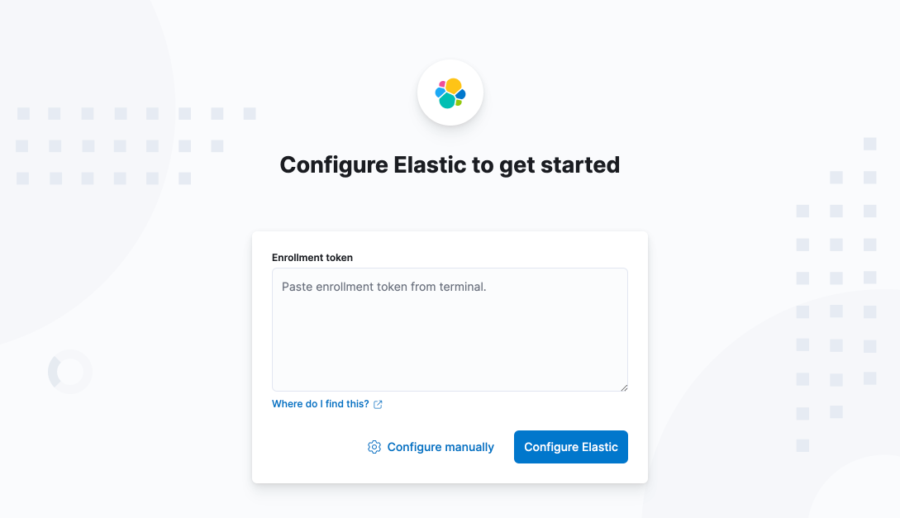
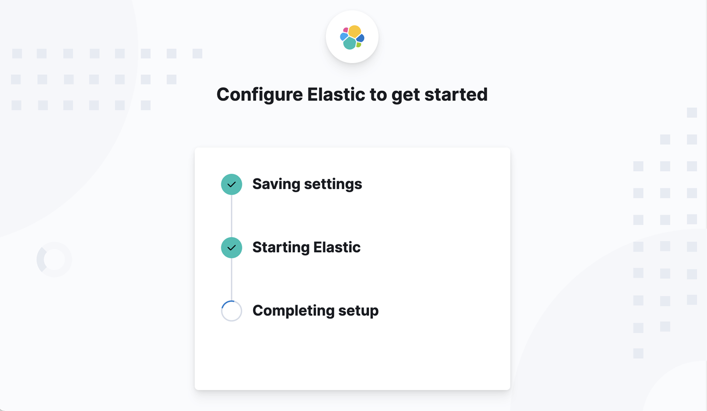
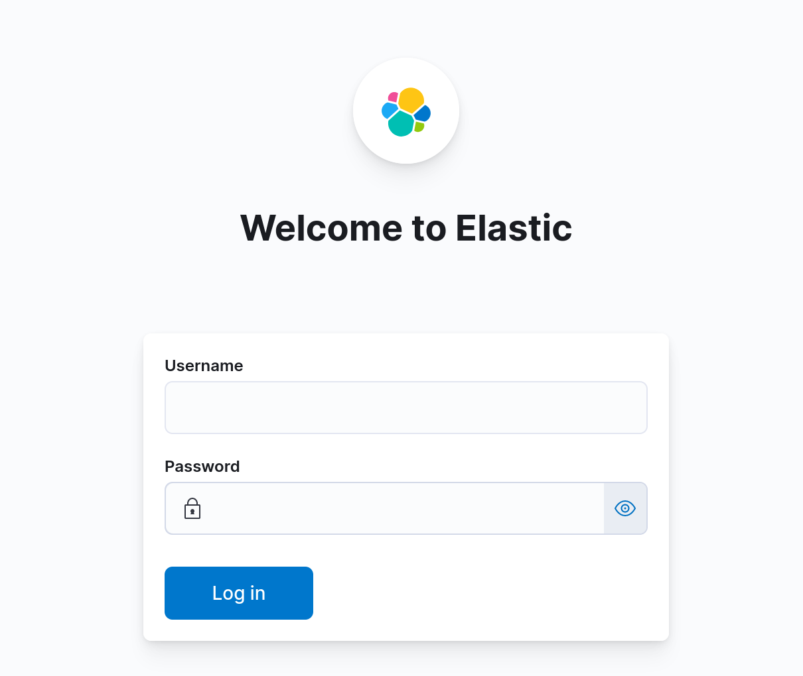
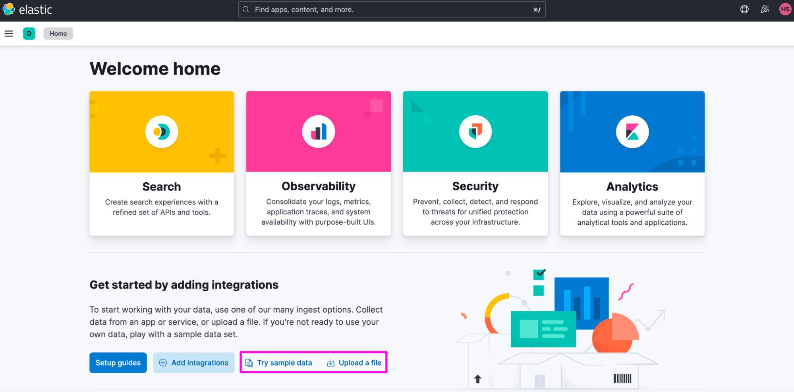

# Elasticsearch 8.19.21 설치

이번 실습에서는 Windows 환경에 Elasticsearch와 Kibana 8.19.21을 설치한다.

## 1. 설치 파일 다운로드

아래 페이지에서 Windows용 ZIP 파일을 내려받는다.

- [Elasticsearch 8.19.21 다운로드](https://www.elastic.co/downloads/past-releases/elasticsearch-8-19-21)
- [Kibana 8.19.21 다운로드](https://www.elastic.co/downloads/past-releases/kibana-8-19-21)

> [!WARNING]
> Elasticsearch와 Kibana의 버전은 반드시 동일하게 맞춘다. 버전이 다르면 연결이나 실행 과정에서 오류가 발생할 수 있다.

## 2. ZIP 파일 압축 해제

다운로드한 ZIP 파일을 원하는 위치에 압축 해제한다.

이 강의에서는 다음 경로를 예시로 사용한다.

```text
E:\app\elk\elasticsearch-8.19.21
E:\app\elk\kibana-8.19.21
```

> [!IMPORTANT]
> 위 경로는 예시이다. 다른 위치에 압축을 풀었다면 이후 명령의 `E:\app\elk\...` 부분을 자신의 실제 설치 경로로 바꿔야 한다.

## 3. Elasticsearch 실행

명령 프롬프트(cmd)를 열고 Elasticsearch의 `bin` 폴더로 이동한다.

```bat
cd /d E:\app\elk\elasticsearch-8.19.21\bin
```

다음 명령으로 Elasticsearch를 실행한다.

```bat
.\elasticsearch.bat
```

첫 실행에는 초기 설정 때문에 시간이 조금 걸릴 수 있다.

> [!WARNING]
> Elasticsearch를 실행한 터미널을 닫으면 서버도 종료된다. Kibana 설정과 실습이 끝날 때까지 이 터미널을 닫지 않는다.

## 4. 초기 보안 설정 확인

첫 실행이 완료되면 터미널에 다음과 비슷한 안내가 출력된다.

```text
-> Elasticsearch security features have been automatically configured!
-> Authentication is enabled and cluster connections are encrypted.

-> Password for the elastic user
  <각자 생성된 elastic 사용자 비밀번호>

-> HTTP CA certificate SHA-256 fingerprint:
  <각자 생성된 인증서 지문>

-> Configure Kibana to use this cluster:
* Run Kibana and click the configuration link in the terminal when Kibana starts.
* Copy the following enrollment token and paste it into Kibana in your browser
  (valid for the next 30 minutes):
  <각자 생성된 Kibana 등록 토큰>
```

다음 세 가지 값은 이후 접속과 Kibana 연결에 필요하므로 **출력되었을 때 바로 복사하여** 별도로 안전하게 보관한다.

1. `elastic` 사용자의 비밀번호
2. HTTP CA 인증서 지문(이번 실습에서는 직접 사용하지 않음)
3. Kibana 등록 토큰(enrollment token)

> [!NOTE]
> HTTP CA 인증서 지문은 Elasticsearch 서버의 인증서를 확인할 때 사용하는 중요한 값이다. 다만 이번 실습에서는 Kibana를 enrollment token으로 연결하므로 이 값을 직접 입력하거나 사용하지 않는다. 이후 외부 클라이언트의 HTTPS 연결을 설정할 때 필요할 수 있으므로 보관해 둔다.

> [!IMPORTANT]
> 비밀번호와 등록 토큰은 개인별로 다르게 생성되는 보안 정보이므로 강의 자료의 예시값을 사용하면 안 된다. 자신의 터미널에 출력된 값을 사용한다. 공개 저장소나 메신저에도 공유하지 않는다.

> [!WARNING]
> Kibana 등록 토큰의 유효 시간은 30분이다. 만료되면 5단계의 명령으로 새 토큰을 생성한다.

이 화면까지 정상적으로 출력되면 Elasticsearch의 설치와 첫 실행이 완료된 것이다.

## 5. 비밀번호 또는 등록 토큰을 다시 생성하는 방법

`elastic` 사용자의 비밀번호를 잊어버렸다면 Elasticsearch의 `bin` 폴더에서 다음 명령을 실행한다.

```bat
.\elasticsearch-reset-password.bat -u elastic
```

Kibana 등록 토큰의 유효 시간이 지났다면 다음 명령으로 새 토큰을 생성한다.

```bat
.\elasticsearch-create-enrollment-token.bat -s kibana
```

> [!IMPORTANT]
> 위 명령들은 Elasticsearch가 실행 중인 상태에서 Elasticsearch의 `bin` 폴더에서 실행한다.

## 6. Kibana 실행

Elasticsearch가 실행 중인 명령 프롬프트는 그대로 둔다. **새 명령 프롬프트(cmd)**를 열고 Kibana의 `bin` 폴더로 이동한다.

> [!WARNING]
> Elasticsearch 터미널에서 Kibana를 실행하지 않는다. Elasticsearch용 터미널과 Kibana용 터미널을 각각 하나씩, 총 2개 실행한다.

```bat
cd /d E:\app\elk\kibana-8.19.21\bin
```

다음 명령으로 Kibana를 실행한다.

```bat
.\kibana.bat
```

Kibana가 시작될 때까지 잠시 기다린다.

> [!WARNING]
> Kibana를 실행한 터미널을 닫으면 Kibana도 종료된다. 실습이 끝날 때까지 닫지 않는다.

## 7. Enrollment token 입력

Kibana가 시작되면 웹 브라우저에서 초기 설정 화면이 열린다. 자동으로 열리지 않으면 다음 주소로 접속한다.

```text
http://localhost:5601
```

화면에 다음과 같이 `Configure Elastic to get started`가 표시되는지 확인한다.



> 참고 이미지와 실습 버전의 세부 디자인이나 문구는 조금 다를 수 있지만, `Enrollment token` 입력란과 진행 방식은 같다.

Elasticsearch를 처음 실행했을 때 발급된 **Kibana enrollment token**을 입력하고 설정을 진행한다.

```text
<Elasticsearch 실행 화면에서 복사한 Kibana enrollment token>
```

> [!WARNING]
> Enrollment token은 `elastic` 사용자 비밀번호가 아니다. Elasticsearch 첫 실행 화면에서 `Configure Kibana to use this cluster` 아래에 표시된 긴 문자열 전체를 복사한다. 줄바꿈 때문에 일부만 복사하지 않도록 주의한다.

토큰의 유효 시간인 30분이 지났다면 Elasticsearch의 `bin` 폴더에서 다음 명령으로 새 토큰을 생성한다.

```bat
cd /d E:\app\elk\elasticsearch-8.19.21\bin
.\elasticsearch-create-enrollment-token.bat -s kibana
```

출력된 새 토큰을 복사하여 Kibana 설정 화면에 입력한다.

## 8. 인증 코드 입력

Enrollment token을 입력하면 Kibana를 실행한 터미널에 다음과 비슷한 안내가 나타난다.

```text
i Kibana has not been configured.

Go to http://localhost:5601/?code=875425 to get started.

Your verification code is:  875 425
```

웹 브라우저의 인증 코드 입력 화면에 터미널에 표시된 6자리 코드를 입력한다.

```text
875 425
```

> [!WARNING]
> `875 425`는 설명을 위한 예시이다. 예시 코드를 그대로 입력하지 말고, 각자의 Kibana 터미널에 표시된 6자리 인증 코드를 입력한다.

인증 코드가 확인되면 Kibana가 설정을 저장하고 Elasticsearch와의 연결을 구성한다. 다음 화면이 나타나면 완료될 때까지 기다린다.



> [!IMPORTANT]
> 설정이 진행되는 동안 브라우저를 닫거나 새로고침하지 않는다. 설정이 완료되면 Kibana 로그인 화면으로 자동 이동한다.

## 9. `elastic` 사용자 비밀번호 변경

Kibana 로그인 화면이 나타나면 로그인하기 전에 `elastic` 사용자의 비밀번호를 실습에서 기억하기 쉬운 값으로 변경한다.

Elasticsearch와 Kibana가 실행 중인 명령 프롬프트는 그대로 두고, **새 명령 프롬프트(cmd)**를 연다. Elasticsearch의 `bin` 폴더로 이동한다.

> [!IMPORTANT]
> 비밀번호 변경 명령은 Kibana의 `bin` 폴더가 아니라 Elasticsearch의 `bin` 폴더에서 실행한다.

```bat
cd /d E:\app\elk\elasticsearch-8.19.21\bin
```

다음 명령을 실행한다. `-i` 옵션은 변경할 비밀번호를 직접 입력하는 대화형 모드를 의미한다.

```bat
.\elasticsearch-reset-password.bat -u elastic -i
```

화면의 안내에 따라 새 비밀번호를 입력하고, 확인을 위해 같은 비밀번호를 한 번 더 입력한다.

```text
Enter password for [elastic]: <새 비밀번호 입력>
Re-enter password for [elastic]: <같은 비밀번호 다시 입력>
```

비밀번호 입력 중에는 화면에 문자나 별표가 표시되지 않을 수 있다. 입력 후 `Enter` 키를 누르면 된다.

> 강의 실습에서는 기억하기 쉬운 비밀번호를 사용해도 되지만, 다른 서비스에서 사용 중인 비밀번호를 재사용하면 안 된다. 운영 환경에서는 충분히 긴 비밀번호를 사용하고 안전하게 관리해야 한다.

## 10. Kibana 로그인

다음과 같은 Kibana 로그인 화면이 나타나는지 확인한다.



> Kibana 버전에 따라 로고, 문구, 버튼 위치 등 화면 디자인은 조금 다를 수 있다.

Kibana 로그인 화면에 다음 계정 정보를 입력한다.

```text
Username: elastic
Password: <9단계에서 새로 설정한 비밀번호>
```

> [!IMPORTANT]
> 로그인 아이디는 `elastic`이다. `elasticsearch` 또는 `kibana`를 입력하지 않는다.

로그인이 완료되면 다음과 같은 Kibana 홈 화면이 나타난다.



> 설치한 Kibana의 버전과 라이선스에 따라 홈 화면의 메뉴나 카드 구성은 조금 다를 수 있다.

Kibana 홈 화면까지 나타나면 Elasticsearch와 Kibana의 설치 및 연결이 모두 끝난 것이다.
