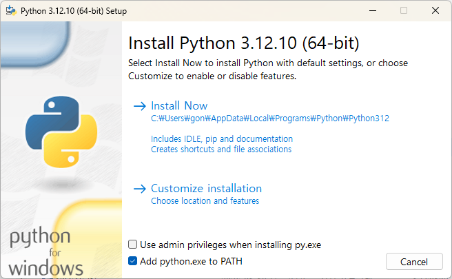
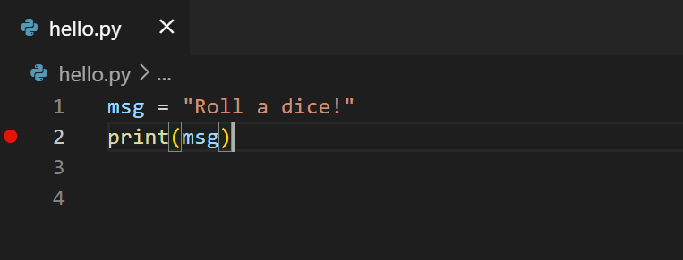
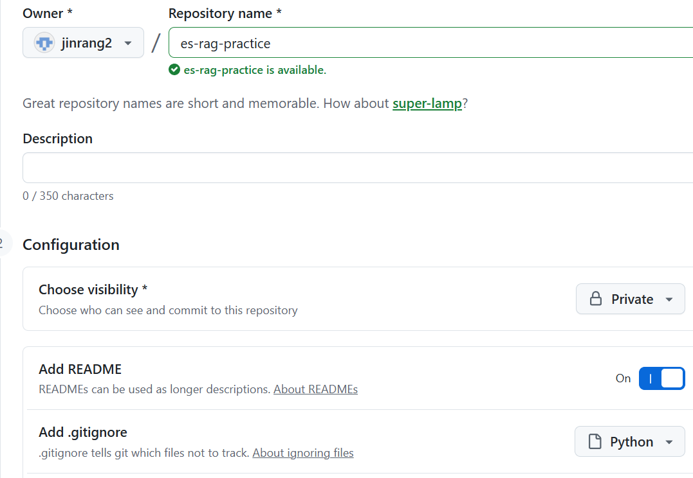
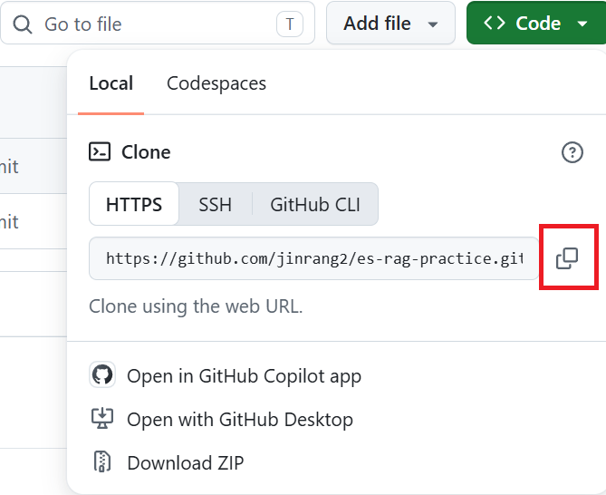

# VS Code·Python·uv·Git 설치와 GitHub 연결

이번 문서에서는 Windows에 VS Code, Python, uv, Git을 설치하고 GitHub 저장소에 첫 변경 사항을 올리는 과정까지 진행합니다.

이 문서의 명령어는 Windows **명령 프롬프트(cmd)**를 기준으로 설명합니다. VS Code 터미널이 PowerShell로 열리면 터미널 오른쪽 위의 화살표를 누르고 **Command Prompt**를 선택해 주세요.

## Part 1. VS Code와 Python, uv 설치

### 1. Visual Studio Code 설치

아래 공식 페이지에서 Windows용 VS Code 설치 파일을 내려받습니다.

- [Visual Studio Code 다운로드](https://code.visualstudio.com/Download)

일반적인 64비트 Windows 컴퓨터에서는 **Windows User Installer x64**를 선택합니다. 내려받은 설치 파일을 실행하고 기본 설정을 유지한 채 설치를 진행합니다.

설치가 끝나면 열려 있던 명령 프롬프트를 닫고 새로 연 뒤 다음 명령을 실행합니다.

```bat
code --version
```

VS Code 버전이 출력되면 설치가 완료된 것입니다.

`code` 명령을 찾을 수 없다는 메시지가 나오면 기존 명령 프롬프트를 닫고 새로 열어 주세요. 그래도 실행되지 않으면 VS Code 설치 프로그램을 다시 실행하고 PATH에 추가하는 항목이 선택되어 있는지 확인합니다.

### 2. Python 설치

아래 공식 페이지에서 Python 3.12.10 Windows 설치 파일을 내려받습니다.

- [Python 3.12.10 다운로드](https://www.python.org/downloads/release/python-31210/)

다운로드 페이지를 연 뒤 화면 맨 아래의 **Files** 항목까지 내려갑니다. 파일 목록에서 **Windows installer (64-bit)**를 클릭해 설치 파일을 내려받습니다. `Windows embeddable package`나 `Windows installer (ARM64)`가 아니라 **Windows installer (64-bit)**를 선택해 주세요.

내려받은 설치 파일을 실행하면 다음과 같은 화면이 나타납니다.



1. 화면 아래의 **Add python.exe to PATH**를 체크합니다.
2. **Install Now**를 눌러 설치합니다.
3. 설치가 끝나면 **Close**를 누릅니다.
4. 열려 있던 명령 프롬프트와 VS Code를 모두 닫고 다시 실행합니다.

> [!WARNING]
> Add python.exe to PATH를 체크하지 않으면 터미널에서 `python` 명령을 찾지 못할 수 있습니다. Install Now를 누르기 전에 반드시 체크해 주세요.

새 명령 프롬프트(cmd)에서 다음 명령으로 설치 결과를 확인합니다.

```bat
python --version
pip --version
```

다음과 같이 Python과 pip 버전이 출력되면 정상적으로 설치된 것입니다.

```text
Python 3.12.10
pip xx.x.x from ... (python 3.12)
```

### 3. VS Code에 Python 확장 설치

1. VS Code를 실행합니다.
2. 왼쪽의 **Extensions** 아이콘을 누르거나 `Ctrl`+`Shift`+`X`를 누릅니다.
3. `Python`을 검색하고 **Python** 확장을 설치합니다.
4. `Python Debugger`를 검색하고 **Python Debugger** 확장을 설치합니다.
5. `Pylance`를 검색하고 **Pylance** 확장을 설치합니다.

세 확장 모두 게시자가 **Microsoft**인지 확인해 주세요.

### 4. uv 설치

`uv`는 Python 패키지 설치와 프로젝트 환경 관리를 간편하게 해 주는 도구입니다. 이후 실습에서는 `pip`와 가상환경 명령을 각각 다루는 대신 `uv`를 사용합니다.

명령 프롬프트(cmd)를 열고 `pip`를 사용해 `uv`를 설치합니다.

```bat
pip install uv
```

설치가 끝나면 열려 있던 명령 프롬프트와 VS Code를 닫고 다시 실행합니다. 다음 명령으로 설치 결과를 확인합니다.

```bat
uv --version
```

`uv 0.x.x`처럼 버전이 출력되면 설치가 완료된 것입니다.

`uv` 명령을 찾을 수 없다는 메시지가 나오면 터미널을 닫고 새로 열어 주세요.

앞으로 자주 사용할 `uv` 명령은 다음과 같습니다. 지금 모두 실행할 필요는 없습니다.

| 명령 | 용도 |
|---|---|
| `uv sync` | 프로젝트에 필요한 패키지를 설치하고 환경을 맞춥니다. |
| `uv add 패키지명` | 프로젝트에 새 패키지를 추가합니다. |
| `uv run 파일명.py` | 프로젝트 환경에서 Python 파일을 실행합니다. |

`uv`가 프로젝트에 필요한 환경을 자동으로 관리하므로 수강생이 가상환경을 직접 만들거나 활성화할 필요가 없습니다.

### 5. Python 파일 실행

VS Code에서 `hello.py` 파일을 만들고 다음 내용을 입력해 저장합니다.

```python
msg = "Python 개발 환경 준비 완료!"
print(msg)
```

VS Code에서 `Terminal` → `New Terminal`을 누른 뒤 다음 명령으로 실행합니다.

```bat
uv run hello.py
```

```text
Python 개발 환경 준비 완료!
```

### 6. 중단점 설정과 디버그 모드 실행

중단점(Breakpoint)은 프로그램을 원하는 줄에서 잠시 멈추는 기능입니다. 멈춘 상태에서 변수에 어떤 값이 들어 있는지 확인하고 코드를 한 줄씩 실행할 수 있습니다.

`print(msg)`가 있는 줄의 왼쪽, 줄 번호 옆을 클릭합니다. 빨간 점이 표시되면 중단점이 설정된 것입니다. 해당 줄에 커서를 놓고 `F9`를 눌러도 됩니다.



중단점을 설정한 뒤 `F5`를 누르거나 왼쪽의 **Run and Debug** 아이콘을 누르고 **Run and Debug**를 선택합니다. 처음 실행할 때 실행 방법을 묻는다면 **Python Debugger → Python File**을 선택합니다.

프로그램이 중단점에서 멈추면 현재 실행할 줄이 노란색으로 표시됩니다. 왼쪽 **VARIABLES → Locals**에서 `msg` 변수의 현재 값을 확인할 수 있습니다. 코드 위의 변수에 마우스를 올려도 값을 볼 수 있습니다.


디버그 화면 위쪽의 도구 모음이나 단축키를 사용해 실행을 이어갑니다.

| 기능 | 단축키 | 설명 |
|---|---|---|
| Continue | `F5` | 다음 중단점까지 계속 실행합니다. |
| Step Over | `F10` | 현재 줄을 실행하고 다음 줄로 이동합니다. |
| Step Into | `F11` | 현재 줄에서 호출하는 함수 내부로 들어갑니다. |
| Step Out | `Shift`+`F11` | 현재 함수의 실행을 마치고 호출한 위치로 돌아갑니다. |
| Stop | `Shift`+`F5` | 디버깅을 종료합니다. |


중단점을 해제하려면 줄 번호 옆의 빨간 점을 다시 클릭하거나 해당 줄에서 `F9`를 누릅니다.

## Part 2. Git과 GitHub 환경 구성

### 1. Git과 GitHub의 차이

- **Git**: 내 컴퓨터에서 파일의 변경 이력을 관리하는 프로그램
- **GitHub**: Git 저장소를 인터넷에 보관하고 다른 사람과 공유하는 서비스

```text
내 컴퓨터의 작업 폴더  ← Git으로 변경 이력 관리
          ↕ clone / pull / push
GitHub의 원격 저장소   ← 인터넷에 코드와 변경 이력 보관
```

### 2. GitHub 계정 만들기

웹 브라우저에서 다음 주소로 이동합니다.

- [GitHub 회원 가입](https://github.com/signup)

화면의 안내에 따라 이메일 주소, 비밀번호, 사용자 이름을 입력하고 계정을 만듭니다. 가입 후 이메일로 전송된 인증 링크를 눌러 **이메일 인증까지 완료**합니다.

이메일 인증을 완료하지 않으면 저장소 생성 등 일부 기능을 사용할 수 없습니다. GitHub 계정 비밀번호는 다른 서비스와 겹치지 않는 안전한 비밀번호를 사용하고, 가능하면 2단계 인증도 설정해 주세요.

### 3. Windows에 Git 설치

아래 공식 페이지에서 최신 Windows용 Git 설치 파일을 내려받습니다.

- [Git for Windows 다운로드](https://git-scm.com/install/windows)

일반적인 64비트 Windows 컴퓨터에서는 **x64 Setup**을 선택합니다. 내려받은 설치 파일을 실행하고 별도의 설정을 변경하지 않은 채 **Next**를 눌러 설치를 진행합니다.

설치가 끝나면 열려 있던 명령 프롬프트를 닫고 새로 엽니다. 다음 명령으로 설치 결과를 확인합니다.

```bat
git --version
```

다음과 같이 버전이 출력되면 설치가 완료된 것입니다.

```text
git version 2.x.x.windows.x
```

### 4. Git 사용자 정보 설정

커밋에 기록할 이름과 이메일을 설정합니다. 아래 예시를 **자신의 정보로 바꿔서** 실행해 주세요.

```bat
git config --global user.name "YOUR-GITHUB-USERNAME"
git config --global user.email "YOUR-EMAIL@example.com"
```

설정된 값을 확인합니다.

```bat
git config --global user.name
git config --global user.email
```

`YOUR-GITHUB-USERNAME`과 `YOUR-EMAIL@example.com`은 GitHub에서 사용하는 자신의 이름과 이메일로 바꿔 주세요. 이메일 공개를 원하지 않으면 GitHub의 비공개 `noreply` 이메일을 사용할 수 있습니다.

### 5. GitHub 저장소 만들기

GitHub에 로그인한 뒤 다음 주소로 이동합니다.

- [새 GitHub 저장소 만들기](https://github.com/new)

다음 항목을 설정합니다.

1. **Owner**: 자신의 GitHub 계정
2. **Repository name**: `es-rag-practice`
3. **Description**: 선택 사항
4. **Visibility**: `Private` 선택
5. **Add a README file**: 체크
6. **Add .gitignore**: 목록에서 `Python` 선택

저장소 이름을 입력하는 화면은 다음과 같습니다. `es-rag-practice`를 입력해 주세요.



설정을 확인한 뒤 **Create repository**를 누릅니다.

### 6. 저장소 주소 복사

생성된 저장소 화면에서 **Code** 버튼을 누릅니다. **Local → HTTPS**가 선택되어 있는지 확인한 뒤 복사 버튼을 누릅니다.



주소는 다음 형식입니다.

```text
https://github.com/YOUR-GITHUB-USERNAME/es-rag-practice.git
```

이 실습에서는 HTTPS 주소를 사용합니다. SSH 주소인 `git@github.com:...`를 복사하면 별도의 SSH 키 설정이 필요합니다.

### 7. GitHub 인증 방식 이해

GitHub에 HTTPS 방식으로 `clone`하거나 `push`할 때 사용할 수 있는 인증 방식은 다음과 같습니다.

| 인증 방식 | 설명 | 이번 실습 |
|---|---|---|
| Git Credential Manager 브라우저 로그인 | 브라우저에서 GitHub에 로그인하면 OAuth 토큰을 안전하게 저장 | **사용 권장** |
| Personal Access Token(PAT) | GitHub에서 직접 발급한 토큰을 비밀번호 대신 입력 | 필요할 때만 사용 |
| GitHub 계정 비밀번호 | 예전 방식의 Git 인증 | **사용 불가** |

> [!WARNING]
> Git 명령에서 비밀번호를 요구하더라도 GitHub 계정 비밀번호를 입력하면 안 됩니다. GitHub는 HTTPS Git 작업의 계정 비밀번호 인증을 지원하지 않습니다.

이번 실습에서는 별도의 토큰을 직접 만들지 않고, Git for Windows에 포함된 **Git Credential Manager의 브라우저 로그인 방식**을 사용합니다. 이 방식도 내부적으로는 안전한 토큰을 사용하지만 생성과 저장을 Git Credential Manager가 대신 처리합니다.

### 8. 저장소 복제와 브라우저 인증

명령 프롬프트(cmd)를 열고 저장소를 내려받을 상위 폴더로 이동합니다. 다음 경로는 예시이므로 자신의 실습 폴더에 맞게 바꿔 주세요.

```bat
cd /d E:\workspace
```

복사한 HTTPS 주소를 사용해 저장소를 복제합니다.

```bat
git clone https://github.com/YOUR-GITHUB-USERNAME/es-rag-practice.git
```

Private 저장소를 처음 복제하면 Git Credential Manager 로그인 창 또는 웹 브라우저가 열립니다.

1. **Sign in with your browser**를 선택합니다.
2. 브라우저에서 자신의 GitHub 계정으로 로그인합니다.
3. 요청이 나타나면 Git Credential Manager의 접근을 승인합니다.
4. 2단계 인증을 사용 중이라면 인증을 완료합니다.
5. 인증 성공 화면이 나타나면 브라우저를 닫고 명령 프롬프트로 돌아옵니다.

브라우저에 여러 GitHub 계정이 로그인되어 있다면 방금 만든 저장소의 소유 계정을 선택해 주세요. 다른 계정을 선택하면 `Permission denied` 또는 `repository not found` 오류가 발생할 수 있습니다.

복제가 완료되면 생성된 저장소 폴더로 이동합니다.

```bat
cd es-rag-practice
git status
```

정상적으로 복제되었다면 현재 브랜치가 `master`이고 변경된 파일이 없다는 내용이 출력됩니다.

```text
On branch master
Your branch is up to date with 'origin/master'.

nothing to commit, working tree clean
```

이후의 모든 Git 명령은 `es-rag-practice` 저장소 폴더 안에서 실행합니다. 다른 폴더에서 실행하면 `not a git repository` 오류가 발생합니다.

### 9. 파일 수정과 첫 커밋

현재 저장소를 VS Code로 엽니다.

```bat
code .
```

`README.md`를 열고 다음과 같은 문장을 한 줄 추가한 뒤 저장합니다.

```markdown
# es-rag-practice

Git과 GitHub의 기본 사용법을 연습하는 저장소입니다.
```

변경한 `README.md`를 커밋 대상으로 추가합니다.

```bat
git add .
git status
```

커밋을 만듭니다.

```bat
git commit -m "Update README"
```

`git add`는 커밋할 변경을 고르는 단계이고, `git commit`은 선택한 변경을 하나의 기록으로 저장하는 단계입니다. 커밋만으로는 GitHub에 올라가지 않습니다.

### 10. 최초 푸시

다음 명령으로 `master` 브랜치의 커밋을 GitHub에 올립니다.

```bat
git push
```

저장소를 복제할 때 브라우저 인증을 완료했다면, 저장된 인증 정보가 사용되므로 로그인 창이 다시 나타나지 않을 수 있습니다.

푸시가 성공하면 마지막 부분에 다음과 비슷한 내용이 출력됩니다.

```text
To https://github.com/YOUR-GITHUB-USERNAME/es-rag-practice.git
   <이전 커밋>..<새 커밋>  master -> master
```

GitHub 저장소 페이지를 새로고침하고 `README.md`의 변경 내용과 `Update README` 커밋이 보이는지 확인합니다.

## 전체 실습 완료 확인

다음 항목을 모두 확인하면 실습 환경 구성이 완료된 것입니다.

- [ ] `code --version` 명령이 정상적으로 실행됩니다.
- [ ] `python --version` 명령에 Python 3.12.10이 표시됩니다.
- [ ] VS Code에 Microsoft의 Python, Python Debugger, Pylance 확장을 설치했습니다.
- [ ] `uv --version` 명령이 정상적으로 실행됩니다.
- [ ] `uv run hello.py`를 실행하고 결과를 확인했습니다.
- [ ] 중단점을 설정하고 디버그 모드에서 `msg` 변수의 값을 확인했습니다.

- [ ] GitHub 계정과 이메일 인증을 완료했습니다.
- [ ] `git --version` 명령이 정상적으로 실행됩니다.
- [ ] Git 사용자 이름과 이메일을 설정했습니다.
- [ ] GitHub에 `es-rag-practice`라는 `Private` 저장소를 만들고 README와 Python용 `.gitignore`를 추가했습니다.
- [ ] HTTPS 주소로 저장소를 복제했습니다.
- [ ] `README.md`를 수정하고 커밋했습니다.
- [ ] 첫 커밋을 GitHub에 푸시했습니다.
- [ ] GitHub 저장소 화면에서 변경 내용을 확인했습니다.
