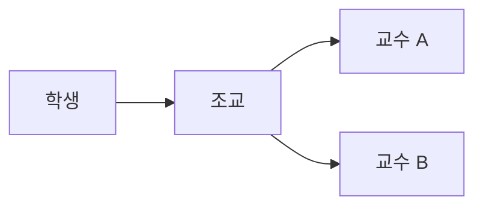
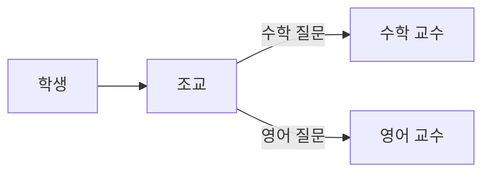
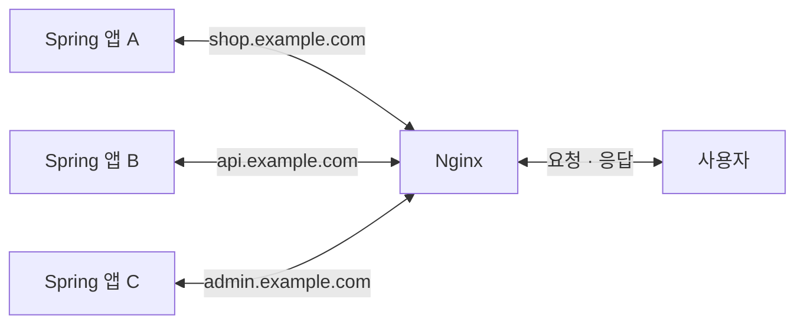
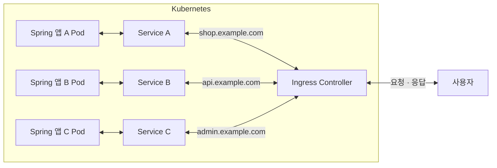

# Filebeat로 로그를 수집하고 Kibana에서 모니터링하기

이번 실습에서는 Windows와 macOS 환경에서 Filebeat 8.19.21을 사용해 Nginx 형식 로그와 Spring Boot 형식 로그를 Elasticsearch로 수집합니다. 실제 Nginx와 Spring Boot 애플리케이션을 실행하지 않고, Python으로 만든 정상 요청과 공격 시나리오의 샘플 로그를 사용합니다. 이전 [집계 실습](../03_05_0918_1009_Elasticsearch_개론/05.kibana.md)에서 배운 계산과 분류를 로그 차트로 확인하고, 같은 데이터로 다음 SIEM Webhook Actions 실습까지 이어갑니다.

## 전체 실습 흐름

Elasticsearch와 Kibana가 실행 중인 상태에서 아래 순서로 진행합니다. 이 자료에서는 로그 생성부터 수집 확인까지 진행하고, [다음 Webhook 실습](7.webhook-actions.md)에서는 SIEM 탐지 규칙과 경보 전송을 설정합니다. 수집된 로그에서 SIEM이 이상 행동을 탐지하면, Action을 통해 FastAPI 수신 앱으로 경보를 전달합니다.


### 프록시

학생이 조교에게 질문하면 조교가 교수에게 전달하고, 교수의 답변을 다시 학생에게 전달합니다. 이렇게 **요청과 응답을 대신 전달하는 역할이 프록시**이고, 이 역할을 하는 서버가 **프록시 서버**입니다.


### 포워드 프록시

**포워드 프록시**는 학생 쪽 조교처럼 **사용자를 대신해 외부 서버에 요청**합니다. 외부 서버의 응답도 프록시를 통해 사용자에게 돌아옵니다. 아래 화살표는 질문을 전달하는 흐름입니다.



### 리버스 프록시

**리버스 프록시**는 교수 쪽 조교처럼 **서버들을 대표하는 접수 창구**입니다. 요청을 받아 알맞은 서버로 전달하고, 응답을 사용자에게 돌려줍니다. 학생은 담당 교수의 위치를 몰라도 접수 창구에 질문하면 됩니다. 아래 화살표는 질문을 전달하는 흐름입니다.



### Nginx로 여러 Spring 앱 연결하기

**Nginx는 여러 Spring 앱의 리버스 프록시**로 사용할 수 있습니다. 사용자의 요청을 먼저 받아 도메인에 맞는 앱으로 전달하고, 앱의 응답을 사용자에게 돌려줍니다. [Nginx 공식 가이드](https://nginx.org/en/docs/beginners_guide.html#proxy)

그림은 **앱을 왼쪽, 프록시를 가운데, 사용자를 오른쪽**에 배치했습니다. 요청은 오른쪽에서 왼쪽으로, 응답은 왼쪽에서 오른쪽으로 이동하며, 하나의 양방향 선으로 표시합니다.

이 과정에서 Nginx는 요청한 IP, URL, 응답 코드 등을 접근 로그에 기록할 수 있습니다. 이번 실습에서는 Nginx와 Spring 앱을 직접 실행하는 대신 해당 형식의 샘플 로그를 Filebeat로 수집합니다.



### Kubernetes에서는 어떻게 연결할까?

Kubernetes에서는 Spring 앱을 **Pod**로 실행하고, 앱별 **Service**를 통해 해당 앱의 Pod들에 접근합니다. **Ingress**에 도메인·경로별 연결 규칙을 정의하면, **Ingress Controller**가 그 규칙을 적용해 사용자 요청을 알맞은 앱에 전달하는 입구 역할을 합니다. Ingress 규칙과 이를 실행하는 Controller는 구분합니다. [Kubernetes Ingress 문서](https://kubernetes.io/docs/concepts/services-networking/ingress/), [Service 문서](https://kubernetes.io/docs/concepts/services-networking/service/)

아래는 연결 관계를 보여 주는 개념도입니다. 앱은 왼쪽에 있고, 사용자 요청은 오른쪽에서 Ingress Controller로 들어옵니다. Service 하나에 같은 앱의 Pod를 여러 개 연결할 수도 있습니다.



## Windows와 macOS의 경로·명령 표기

**이 자료의 경로 구분자는 `/`로 통일합니다.** YAML 설정과 이 실습의 Windows PowerShell 경로에서도 `/`를 사용할 수 있습니다. 운영체제에 따라 달라지는 것은 절대 경로의 시작 부분과 실행 파일 이름입니다.

| 항목 | Windows 예시 | macOS 예시 |
|---|---|---|
| 강의 프로젝트 폴더 | `E:/codex/2609_kookmin_rag` | `/Users/사용자명/codex/2609_kookmin_rag` |
| Spring 로그 | `E:/codex/2609_kookmin_rag/06_1009_observability/logs/spring.log` | `/Users/사용자명/codex/2609_kookmin_rag/06_1009_observability/logs/spring.log` |
| Nginx 로그 | `E:/codex/2609_kookmin_rag/06_1009_observability/logs/nginx.log` | `/Users/사용자명/codex/2609_kookmin_rag/06_1009_observability/logs/nginx.log` |
| Elasticsearch CA 인증서 | `E:/app/elk/elasticsearch-8.19.21/config/certs/http_ca.crt` | `/Users/사용자명/app/elk/elasticsearch-8.19.21/config/certs/http_ca.crt` |
| Filebeat 실행 | `./filebeat.exe` | `./filebeat` |

**본문의 Filebeat 명령은 `./filebeat`로 통일합니다.** macOS의 실행 파일 이름은 `filebeat`이고, Windows는 `filebeat.exe`입니다. Windows PowerShell에서도 `.exe`를 생략한 `./filebeat`로 실행할 수 있습니다. 확장자를 명시할 때만 `./filebeat.exe`로 입력하며, 뒤에 붙는 옵션과 명령은 같습니다.

위 경로는 예시이므로 실제 설치 위치에 맞게 바꿉니다. macOS의 `사용자명`은 본인의 계정 이름으로 바꿉니다. **YAML의 로그·인증서 경로에는 전체 절대 경로를 적습니다.** 셸의 `~`나 `$HOME` 표기를 그대로 복사하지 않습니다.

**기본 명령은 Windows PowerShell과 macOS 터미널에서 공통으로 사용합니다.** `cd`는 폴더 이동, `ls`는 파일 목록 확인, `pwd`는 현재 위치 확인입니다. 공통 예시에서는 운영체제마다 옵션이 다른 `ls -l` 대신 `ls 경로`를 사용합니다.

강의 프로젝트 폴더에서 다음 명령으로 실행 위치와 로그 폴더를 확인할 수 있습니다.

```shell
pwd
ls
cd ./06_1009_observability
ls ./logs
cd ..
```

명령을 실행하는 위치도 구분합니다. **로그 생성기와 FastAPI는 강의 프로젝트 폴더**, **Filebeat는 압축을 푼 Filebeat 설치 폴더**에서 실행합니다. 파일 확인과 `uv`, Filebeat 명령은 공통으로 사용합니다. JSON을 읽는 셸 문법이나 종료 코드처럼 실제로 다른 부분만 운영체제별로 나눕니다.

## 1. Filebeat의 역할

Filebeat는 로그 파일을 지속적으로 읽어 Elasticsearch나 Logstash로 전달하는 수집기입니다. 파일 전체를 매번 전송하지 않고 마지막으로 읽은 위치 이후에 추가된 내용만 전송합니다.

이번 실습에서는 두 가지 수집 방식을 사용합니다.

| 로그 | 수집 방식 | 특징 |
|---|---|---|
| `nginx.log` | Nginx 모듈 | Nginx 로그 형식을 해석하고 ECS 필드로 변환 |
| `spring.log` | `filestream` 입력 | 한 줄에 하나씩 기록된 JSON을 그대로 해석 |

Nginx 모듈은 미리 알려진 로그 형식에 적합하고, `filestream`은 애플리케이션이 직접 만든 로그를 수집할 때 유용합니다.

## 2. Filebeat 다운로드와 압축 해제

아래 페이지에서 Elasticsearch와 같은 버전의 설치 파일을 내려받습니다. Windows는 **Windows ZIP x86_64**, Intel Mac은 **macOS x86_64**, Apple Silicon Mac은 **macOS aarch64**를 선택합니다.

- [Filebeat 8.19.21 다운로드](https://www.elastic.co/downloads/past-releases/filebeat-8-19-21)

Windows의 Filebeat 설치 경로 예시는 다음과 같습니다. macOS는 내려받은 압축 파일을 푼 폴더에서 진행합니다.
다른 위치에 압축을 풀었다면 이후 명령과 설정의 경로를 자신의 환경에 맞게 바꿉니다.

```text
E:/app/elk/filebeat-8.19.21-windows-x86_64
```


**설치 확인**

Filebeat 설치 폴더에서 실행합니다.

```shell
./filebeat version
```

출력에 `filebeat version 8.19.21`이 표시되면 실행 파일과 버전이 확인된 것입니다.

## 3. SIEM용 샘플 로그 생성

| 시나리오 | 출발지 IP | 기본 건수 | 관찰할 내용 |
|---|---|---:|---|
| 일반 요청 | `10.20.0.10`~`10.20.0.13` | 750 | 정상 200 응답과 일부 500 오류 |
| 계정 공격 | `198.51.100.23` | 62 | 로그인 실패 59건 → 성공 → 관리자 접근 거부 → 고객 데이터 다운로드 |
| 경로 스캔 | `203.0.113.45` | 50 | `.env`, `.git/config`, `actuator/env` 등 여러 경로에 접근, 404 |
| SQL 인젝션 시도 | `203.0.113.66` | 37 | 의심스러운 입력과 sqlmap User-Agent, 검증에서 403으로 거부 |
| 요청 폭주 | `198.51.100.99` | 101 | 상품 API에 요청 집중, 일부 429 응답 |

Windows / macOS 공통

```bash
uv run --no-project ./06_1009_observability/generate_sample_logs.py --scenario siem --output-dir ./06_1009_observability/logs --count 2000 --attack-rate 0.25 --error-rate 0.1
```

실행이 끝나면 다음 두 파일이 만들어집니다.

```shell
./06_1009_observability/logs/nginx.log
./06_1009_observability/logs/spring.log
```

  - `--attack-rate`는 전체 요청 중 공격 요청 비율입니다. 
  - `--error-rate`는 일반 요청 중 500 오류 비율이며 공격에서 발생하는 401/403/404/429 응답과 구분합니다. 

Filebeat가 이미 수집 중인 파일에 새 로그를 추가할 때는 `--append`를 사용합니다. 
탐지 규칙을 활성화한 뒤 경보를 시연할 때는 다음과 같이 최근 1분의 로그를 추가합니다.

Windows / macOS 공통

```bash
uv run --no-project ./06_1009_observability/generate_sample_logs.py --scenario siem --minutes 1 --append --output-dir ./06_1009_observability/logs
```

## 4. 수집 구조 설정

Filebeat 설치 폴더의 `filebeat.yml`을 VS Code로 엽니다.

이후 Filebeat 확인 명령은 **Filebeat 설치 폴더**에서 실행합니다. Windows PowerShell과 macOS 터미널 모두 본문의 공통 Filebeat 명령을 사용합니다. 아래 YAML 예시의 Windows 절대 경로는 macOS에서 앞의 경로 표에 있는 macOS 절대 경로로 바꿉니다. 설정을 수정한 뒤에는 파일을 저장합니다. Filebeat가 이미 실행 중이면 종료 후 다시 실행해야 변경한 설정이 적용됩니다.

### 4.1 Spring Boot 로그 입력

**Filebeat가 미리 알고 있는 로그 형식이 아닌, 앱에서 직접 정의한 커스텀 로그를 수집하는 방식입니다.** 이번 Spring Boot 샘플은 직접 만든 JSON 형식이므로, 전용 모듈 대신 `filestream` 입력과 `ndjson` 파서로 읽습니다.

`spring.log`는 한 줄에 하나의 JSON 객체가 들어 있습니다. `filestream` 입력과 `ndjson` 파서를 사용하면 JSON 속성을 Elasticsearch의 필드로 저장할 수 있습니다.

```yaml
filebeat.inputs:
  - type: filestream
    id: spring-log
    enabled: true

    paths:
      - "E:/codex/2609_kookmin_rag/06_1009_observability/logs/spring.log"

    parsers:
      - ndjson:
          target: ""
          overwrite_keys: true
          add_error_key: true
          expand_keys: true
```

주요 설정의 의미는 다음과 같습니다.

| 설정 | 의미 |
|---|---|
| `type: filestream` | 파일에 추가되는 로그를 계속 읽음 |
| `id: spring-log` | 입력을 구분하는 고유 이름 |
| `paths` | 수집할 로그 파일 위치 |
| `target: ""` | JSON 속성을 최상위 필드로 저장 |
| `overwrite_keys: true` | 로그의 `@timestamp` 등으로 Filebeat 기본 필드를 덮어쓸 수 있게 함 |
| `expand_keys: true` | `log.level` 같은 점 표기 필드를 객체 구조로 확장 |

**입력 설정 확인**

먼저 **강의 프로젝트 폴더**에서 로그 파일이 있는지 확인합니다. Windows / macOS 공통 명령입니다.

```shell
ls ./06_1009_observability/logs/spring.log
```

파일 이름이 표시되면 로그가 있는 것입니다. 파일이 없다는 오류가 나오면 로그 생성 위치를 확인합니다. YAML의 `paths`도 해당 파일의 실제 절대 경로와 일치해야 합니다.


이어서 **Filebeat 설치 폴더**에서 설정 문법을 검사합니다.

```shell
./filebeat test config -c ./filebeat.yml -e
```

`Config OK`는 설정 문법 확인입니다. 실제 수집과 전송은 11~13절에서 확인합니다. 아직 출력 설정을 작성하지 않아 검사가 실패하면 4.3절까지 설정한 뒤 다시 검사합니다.

### 4.2 모듈 설정 불러오기

**Filebeat가 미리 알고 있는 앱의 로그 형식을 활용하는 방식입니다.** Filebeat는 Nginx처럼 알려진 앱의 로그를 해석하는 모듈을 제공합니다. 아래 설정은 해당 모듈의 설정 파일을 불러오며, 실제 사용할 Nginx 모듈의 활성화와 로그 경로 지정은 다음 단계에서 진행합니다.

Nginx 모듈 설정은 `modules.d` 디렉터리에 저장됩니다. Filebeat가 이 디렉터리의 설정을 불러오도록 다음 내용을 추가합니다.

```yaml
filebeat.config.modules:
  path: ${path.config}/modules.d/*.yml
  reload.enabled: false
```

`reload.enabled: false`는 실행 중에 모듈 설정 파일의 변경 여부를 반복해서 검사하지 않는다는 의미입니다. 설정을 바꾼 뒤 Filebeat를 다시 실행하면 변경 내용이 적용됩니다.

**모듈 설정 확인**

**Filebeat 설치 폴더**에서 모듈 파일을 확인합니다. Windows / macOS 공통 명령입니다.

```shell
ls ./modules.d/nginx.yml*
```

`nginx.yml.disabled` 또는 `nginx.yml`이 표시되는지 확인합니다. `.disabled`는 아직 활성화하지 않은 상태이며, 다음 5절에서 활성화하면 `nginx.yml`로 바뀝니다.

이어서 설정 문법을 검사합니다.

```shell
./filebeat test config -c ./filebeat.yml -e
```

`Config OK`가 정상 결과입니다. 문법 검사만으로 모듈 실행이나 로그 파싱까지 확인되는 것은 아닙니다.

### 4.3 Elasticsearch 출력과 Kibana 주소 설정

앞의 로그 입력과 모듈 설정에 이어, **아래 내용도 같은 `filebeat.yml`에 반드시 설정합니다.** `output.elasticsearch`는 수집한 로그를 보낼 서버와 인증 정보를 지정하고, `setup.kibana`는 예제 대시보드를 설치할 Kibana 주소를 지정합니다. 두 항목은 `filebeat.inputs`와 같은 최상위 들여쓰기 수준에 작성합니다.

기본 파일에 `output.elasticsearch`나 `setup.kibana`가 이미 있다면 해당 항목을 아래 값으로 수정합니다. 같은 항목을 중복해서 추가하지 않습니다.

```yaml
output.elasticsearch:
  hosts:
    - "https://localhost:9200"

  username: "elastic"
  password: "elastic"

  ssl.certificate_authorities:
    - "E:/app/elk/elasticsearch-8.19.21/config/certs/http_ca.crt"

  preset: latency

setup.kibana:
  host: "http://localhost:5601"
```

위 예시는 실습 계정의 비밀번호를 `elastic`으로 설정한 경우입니다. 비밀번호와 CA 인증서 경로는 자신의 Elasticsearch 환경에 맞춥니다.

`preset: latency`는 새 로그가 Elasticsearch에서 보이기까지의 지연을 줄이는 성능 설정입니다. 이번 실습에서는 로그 추가 후 탐지 결과를 빠르게 확인하기 위해 사용합니다. [Filebeat 8.19 Elasticsearch 출력 설정](https://www.elastic.co/guide/en/beats/filebeat/8.19/elasticsearch-output.html#_preset)

**연결 설정 확인**

```shell
./filebeat test config -c ./filebeat.yml -e
./filebeat test output -c ./filebeat.yml -e
```

첫 명령의 `Config OK`로 전체 설정 문법을 확인합니다. 
`test output`은 Elasticsearch 연결을 검사합니다. 

### 4.4 작성 완료된 filebeat.yml 전체 내용

앞의 4.1~4.3 설정을 합친 **최종 `filebeat.yml` 전체 내용**입니다. Filebeat 설치 폴더의 `filebeat.yml`에 아래 내용을 저장하면 됩니다.

Windows와 macOS의 설정 구조는 같습니다. 아래는 Windows 경로 예시이므로 **Spring 로그 경로와 CA 인증서 경로, 비밀번호는 자신의 환경에 맞게 바꿉니다.** macOS 학생은 앞의 경로 표를 참고해 `/Users/사용자명/...` 형식의 실제 절대 경로를 사용합니다.

```yaml
filebeat.inputs:
  - type: filestream
    id: spring-log
    enabled: true
    paths:
      - "E:/codex/2609_kookmin_rag/06_1009_observability/logs/spring.log"
    parsers:
      - ndjson:
          target: ""
          overwrite_keys: true
          add_error_key: true
          expand_keys: true

filebeat.config.modules:
  path: ${path.config}/modules.d/*.yml
  reload.enabled: false

output.elasticsearch:
  hosts:
    - "https://localhost:9200"
  username: "elastic"
  password: "elastic"
  ssl.certificate_authorities:
    - "E:/app/elk/elasticsearch-8.19.21/config/certs/http_ca.crt"
  preset: latency

setup.kibana:
  host: "http://localhost:5601"
```

Nginx의 로그 경로는 다음 5절에서 **별도 파일인 `modules.d/nginx.yml`**에 설정합니다. 이 `filebeat.yml`의 모듈 로딩 설정이 해당 파일을 불러옵니다.

저장 후에는 앞의 문법·연결 확인 명령을 실행하고, `Config OK`와 Elasticsearch 연결 `OK`를 확인합니다.

## 5. Nginx 모듈 활성화

Filebeat 설치 폴더에서 다음 명령을 실행합니다.

```shell
./filebeat modules enable nginx
```

활성화 여부를 확인합니다.

```shell
./filebeat modules list
```

`Enabled` 아래에 `nginx`가 표시되면 모듈이 활성화된 것입니다.

이제 `modules.d/nginx.yml`을 열고 access 로그 경로를 지정합니다.

```yaml
- module: nginx
  access:
    enabled: true
    var.paths:
      - "E:/codex/2609_kookmin_rag/06_1009_observability/logs/nginx.log"

  error:
    enabled: false

  ingress_controller:
    enabled: false
```

이번 샘플은 Nginx access 로그 형식이므로 `access`만 활성화합니다. Nginx 모듈은 한 줄의 로그를 분석하여 다음과 같은 필드를 만듭니다.

```text
event.dataset: nginx.access
http.request.method: GET
http.response.status_code: 200
url.original: /api/products
source.address: 1.1.1.1
user_agent.original: Mozilla/5.0 ...
```

이처럼 모듈을 사용하면 원본 문자열을 직접 나누는 코드를 작성하지 않아도 검색과 차트에 사용할 필드를 얻을 수 있습니다.

**Nginx 설정 확인**

먼저 **강의 프로젝트 폴더**에서 로그 파일을 확인합니다. Windows / macOS 공통 명령입니다.

```shell
ls ./06_1009_observability/logs/nginx.log
```

이어서 **Filebeat 설치 폴더**에서 모듈 활성화와 설정 문법을 확인합니다.

```shell
./filebeat modules list
./filebeat test config -c ./filebeat.yml -e
```

로그 파일 이름, `Enabled` 아래의 `nginx`, 문법 검사 `Config OK`를 확인합니다. 실행 시 `nginx (access)`가 로드되고 실제 로그가 파싱되는지는 11절의 실행 로그와 Kibana 문서로 확인합니다.

## 6. Elasticsearch 출력 설정

`filebeat.yml`에 Elasticsearch 연결 정보를 설정합니다.

```yaml
output.elasticsearch:
  hosts:
    - "https://localhost:9200"

  username: "elastic"
  password: "elastic"

  ssl.certificate_authorities:
    - "E:/app/elk/elasticsearch-8.19.21/config/certs/http_ca.crt"

  preset: latency
```

Elasticsearch 8의 자동 보안 설정을 사용하면 HTTP 연결도 HTTPS로 암호화됩니다. `http_ca.crt`는 Filebeat가 현재 Elasticsearch의 인증서를 신뢰할 수 있도록 확인해 주는 CA 인증서입니다. `http.p12`가 아니라 `http_ca.crt`를 지정합니다.

`preset: latency`는 새 로그가 Elasticsearch에서 보이기까지의 지연을 줄이는 성능 설정입니다. 이번 실습에서는 로그 추가 후 탐지 결과를 빠르게 확인하기 위해 사용합니다.

**Elasticsearch 출력 확인**

먼저 **Elasticsearch 설치 폴더**에서 인증서 파일을 확인합니다. Windows / macOS 공통 명령입니다.

```shell
ls ./config/certs/http_ca.crt
```

파일 이름이 표시되는지 확인하고, YAML의 `ssl.certificate_authorities`에 이 파일의 실제 절대 경로를 지정합니다.

이어서 **Filebeat 설치 폴더**에서 출력 연결을 검사합니다.

```shell
./filebeat test output -c ./filebeat.yml -e
```

TLS `handshake`와 `talk to server`가 `OK`이면 정상입니다. 실패하면 다음 항목을 확인합니다.

| 오류 | 확인할 내용 |
|---|---|
| `x509` 또는 인증서 오류 | `http_ca.crt` 경로와 현재 Elasticsearch의 CA 인증서인지 확인 |
| `401 Unauthorized` | `username`과 `password` 확인 |
| 연결 거부 또는 시간 초과 | Elasticsearch 실행 여부와 `hosts`의 주소·포트 확인 |

## 7. Kibana 주소 설정

`filebeat.yml`에 Kibana 주소를 설정합니다.

```yaml
setup.kibana:
  host: "http://localhost:5601"
```

로그 데이터는 Filebeat에서 Elasticsearch로 직접 전송되므로 평상시 수집에는 Kibana 주소가 필요하지 않습니다. 이 주소는 `setup` 명령이 Kibana에 예제 대시보드와 데이터 뷰를 등록할 때 사용합니다.

**Kibana 주소 확인**

브라우저에서 `http://localhost:5601`을 열어 Kibana 로그인 화면 또는 홈 화면이 표시되는지 확인합니다. 화면이 열리지 않으면 Kibana 실행 여부와 `setup.kibana.host`를 확인합니다.

브라우저 접속은 주소가 열리는지 확인하는 단계입니다. Filebeat가 해당 주소로 대시보드를 등록할 수 있는지는 10절의 `setup` 실행 결과와 Kibana의 Nginx 대시보드로 확인합니다.

완성된 `filebeat.yml` 전체 내용은 **4.4절**에서 확인합니다.

## 8. Elasticsearch 실행 확인

Elasticsearch와 Kibana가 실행 중인지 확인합니다. 

### elastic 확인 url
https://localhost:9200

### kibana 확인 url
http://localhost:5601

## 9. Filebeat 설정과 연결 테스트

Filebeat 설치 폴더에서 설정 파일의 문법을 검사합니다.

```shell
./filebeat test config -e
```

마지막에 다음 결과가 출력되면 설정 문법 검사가 통과한 것입니다. 파일 존재 여부와 실제 수집·파싱까지 확인한 결과는 아니므로, 앞의 단계별 확인과 11~13절의 수집 확인도 진행합니다.

```text
Config OK
```

이어서 Elasticsearch 연결을 검사합니다.

```shell
./filebeat test output -e
```

다음 항목이 모두 `OK`인지 확인합니다.

```text
parse url... OK
connection...
TLS...
  handshake... OK
talk to server... OK
```

## 10. 템플릿과 예제 대시보드 설치

다음 명령은 Filebeat가 사용할 인덱스 템플릿과 Kibana 예제 대시보드를 설치합니다.

```shell
./filebeat setup -e
```

처음 실행할 때는 여러 대시보드를 등록하므로 잠시 시간이 걸릴 수 있습니다.

**설치 완료 확인**

`setup` 후 다음과 같은 완료 메시지를 확인합니다.

```text
Loaded Ingest pipelines
```

`Loaded Ingest pipelines`는 로그를 해석할 Ingest pipeline을 Elasticsearch에 로드하는 작업이 성공했다는 뜻입니다. 오류 없이 위 설정 작업이 끝나고 프롬프트가 다시 나타나면 설치가 완료된 것입니다.

`setup`은 수집을 시작하는 명령이 아닙니다. 로그를 보여 줄 화면과 Elasticsearch 저장 구조를 준비하는 명령이며, 일반적으로 실습 환경에서 한 번만 실행합니다.

## 11. Filebeat 실행

다음 명령으로 로그 수집을 시작합니다.

```shell
./filebeat -e
```

`-e`는 Filebeat의 실행 로그를 현재 터미널에 출력합니다. 다음과 같은 내용이 보이면 Nginx 모듈이 함께 실행된 것입니다.

```text
Enabled modules/filesets: nginx (access)
```

Filebeat가 실행 중인 동안 터미널을 유지합니다. 실행을 종료하려면 `Ctrl+C`를 누릅니다.

**실제 수집 확인**

터미널에서 `nginx (access)`가 로드되는지 확인하고, 파일 경로·JSON 파싱·인증·전송 오류가 반복되는지 살펴봅니다. 터미널이 계속 실행되는 것만으로 수집 성공을 판단하지 않습니다.

Kibana **Dev Tools**에서 두 종류의 로그가 각각 수집됐는지 확인합니다.

```http
GET filebeat-*/_count
{
  "query": {
    "term": {
      "event.dataset": "spring.application"
    }
  }
}

GET filebeat-*/_count
{
  "query": {
    "term": {
      "event.dataset": "nginx.access"
    }
  }
}
```

각 응답의 `count`가 1 이상이면 해당 로그가 Elasticsearch에 저장된 것입니다. 실행 직후에는 전송과 검색 반영을 잠시 기다린 뒤 다시 조회합니다. 한쪽만 `0`이면 해당 입력 또는 모듈의 로그 경로를 확인합니다. `filebeat-*` 자체가 없으면 연결 검사와 Filebeat 실행 로그부터 확인합니다.

13절의 **Discover**에서 Spring 문서의 `event.dataset`, `log.level`, `http.response.status_code`와 Nginx 문서의 `event.dataset`, `url.original`, `http.response.status_code`를 확인합니다. 필드가 채워졌는지와 `error.message` 같은 파싱 오류 필드가 있는지도 확인해야 로그 해석까지 검증할 수 있습니다.

## 12. 데이터 스트림 확인

Kibana에서 **Dev Tools**를 열고 다음 요청을 실행합니다.

```http
GET _data_stream/filebeat*
```

Filebeat 8은 일반 인덱스 대신 다음과 같은 데이터 스트림을 기본으로 사용합니다.

```text
filebeat-8.19.21
```

실제 문서는 데이터 스트림 내부의 백킹 인덱스에 저장됩니다.

```text
.ds-filebeat-8.19.21-2026.09.15-000001
```

사용자는 보통 `.ds-`로 시작하는 백킹 인덱스를 직접 선택하지 않고 `filebeat-*` 패턴으로 데이터 스트림을 조회합니다.

수집된 문서 수는 다음 요청으로 확인합니다.

```http
GET filebeat-*/_count
```

최근 문서 몇 건을 직접 확인할 수도 있습니다.

```http
GET filebeat-*/_search
{
  "size": 5,
  "sort": [
    {
      "@timestamp": "desc"
    }
  ],
  "_source": [
    "@timestamp",
    "message",
    "event.dataset",
    "log.file.path",
    "http.response.status_code"
  ]
}
```

## 13. Discover에서 로그 확인

Kibana에서 **Discover**를 열고 데이터 뷰로 `filebeat-*`를 선택합니다.

로그가 보이지 않으면 오른쪽 위의 시간 범위를 `Last 24 hours`로 넓힙니다. 샘플 로그의 `@timestamp`는 생성 시각을 기준으로 최근 60분에 분포하므로, 시간이 지난 뒤 확인하면 기본값인 `Last 15 minutes` 범위에서 제외될 수 있습니다.

Spring 로그는 다음 필드로 확인할 수 있습니다.

```text
log.level
url.path
http.response.status_code
message
```

Nginx 로그만 보고 싶다면 검색창에 다음 KQL을 입력합니다.

```text
event.dataset: "nginx.access"
```

500 오류만 확인하려면 다음과 같이 검색합니다.

```text
http.response.status_code: 500
```

두 조건을 함께 사용할 수도 있습니다.

```text
event.dataset: "nginx.access" and http.response.status_code: 500
```

## 14. 대시보드에서 집계 결과 확인

### 14.1 Nginx 예제 대시보드

Kibana에서 **Dashboards**를 열고 `Nginx`를 검색합니다. Filebeat가 설치한 Nginx 대시보드는 `event.dataset`, `http.response.status_code`, `source.address`, `url.original`처럼 Nginx 모듈이 만든 필드를 사용합니다.

대시보드는 데이터를 별도로 저장하지 않습니다. 저장된 검색 조건과 차트 구성을 가지고 `filebeat-*` 데이터에서 필요한 필드를 조회합니다. 따라서 다음 조건이 맞아야 차트가 표시됩니다.

- Nginx 모듈이 활성화되어 있어야 합니다.
- 로그가 Nginx 모듈을 통해 파싱되어야 합니다.
- 대시보드의 시간 범위 안에 데이터가 있어야 합니다.

Spring 로그는 Nginx 전용 필드를 모두 가지고 있지 않으므로 Nginx 예제 대시보드에는 나타나지 않을 수 있습니다. Spring 로그는 Discover에서 확인하거나 `log.level`, `url.path`, `http.response.status_code`를 사용해 별도의 차트를 만듭니다.

### 14.2 Spring 로그로 집계 차트 만들기

이번 단계에서는 수집한 로그의 상태와 요청량을 차트로 보여 줍니다. 앞에서 배운 버킷 집계를 실제 로그 분석에 적용하는 단계입니다.

Kibana 8.19에서는 **Create visualization** 버튼을 누르면 Lens 편집기가 열립니다. `Lens 시각화 추가`라는 이름의 메뉴를 찾을 필요는 없습니다. [Kibana 8.19 대시보드 생성 문서](https://www.elastic.co/guide/en/kibana/8.19/create-dashboard.html)

1. **Dashboards → Create dashboard**를 선택합니다.
2. **Create visualization**을 눌러 Lens 편집기를 엽니다. 기존 대시보드를 열었다면 먼저 **Edit**를 누릅니다.
3. 데이터 뷰를 `filebeat-*`로 선택하고, 아래의 「Lens에서 차트와 집계 설정하기」 순서와 표에 따라 차트 유형·필드·집계 함수를 설정합니다.
4. 차트를 완성하면 **Save and return**으로 대시보드에 추가합니다.

**Add from library**는 이미 저장된 시각화를 가져오는 메뉴입니다. 이번 실습에서는 **Create visualization**으로 새 차트를 만듭니다.

각 차트에 다음 KQL 필터를 적용해서 Spring 로그만 집계합니다.

```text
event.dataset: "spring.application"
```

**Lens에서 차트와 집계 설정하기**

응답 코드별 요청 건수는 **Pie**(원형 차트)로 만듭니다.

1. 상단의 차트 유형 선택 메뉴에서 **Pie**를 선택합니다.
2. 왼쪽 필드 목록에서 `http.response.status_code`를 오른쪽 **Slice by** 영역으로 끌어 놓습니다.
3. 추가된 필드를 클릭하고 **Quick function**을 **Top values**, 표시 개수를 `10`으로 설정합니다.
4. **Metric**에는 **Count of records**를 선택합니다. 이미 추가되어 있다면 그대로 둡니다.

**Slice by**는 응답 코드별로 조각을 나누고, **Metric**은 각 조각의 크기를 요청 건수로 정합니다. 응답 코드별 비율이 원형 차트로 나타나면 정상입니다.

시간별 요청량과 로그인 실패 IP별 건수는 다음과 같이 설정합니다.

1. 차트 유형을 각각 **Line**(선), **Bar**(막대)로 선택합니다. 막대 차트는 세로 방향(**Vertical**)으로 설정합니다.
2. 아래 표의 필드를 **Horizontal axis**(가로축)에 끌어 놓고, 필드를 클릭해 집계 함수를 선택합니다.
3. **Vertical axis**(세로축)에는 **Count of records**를 선택합니다. **Break down by**(계열 나누기)는 비워 둡니다.

| 저장할 차트 이름 | 차트 유형 | 분류 영역과 필드 | 분류 집계 함수 | 값 영역과 집계 함수 |
|---|---|---|---|---|
| 응답 코드별 요청 건수 | Pie | Slice by: `http.response.status_code` | Top values · 표시 개수 10 | Metric: Count of records |
| 시간별 요청량 | Line | Horizontal axis: `@timestamp` | Date histogram · 간격 Auto | Vertical axis: Count of records |
| 로그인 실패 IP별 건수 | Bar · Vertical | Horizontal axis: `source.ip` | Top values · 표시 개수 10 | Vertical axis: Count of records |

**Count of records**는 문서 수를 세는 함수이므로 별도의 숫자 필드를 지정하지 않습니다. 시간별 차트는 시간에 따른 요청 건수의 선이 나타나면 정상입니다. [Kibana Lens 8.19 문서](https://www.elastic.co/guide/en/kibana/8.19/lens.html)

로그인 실패 차트에는 다음 KQL을 적용합니다.

```text
event.dataset: "spring.application" and event.category: "authentication" and event.outcome: "failure"
```

Top values는 `terms`처럼 같은 값을 가진 문서를 묶고, Count of records는 그 묶음의 문서 수를 보여 줍니다. 시간별 요청량은 시간 구간별로 문서를 묶어 변화 추이를 보여 줍니다. 세 차트를 `샘플 로그 모니터링` 대시보드에 저장합니다.

시간 범위에 생성한 로그가 포함되도록 설정합니다. IP별 로그인 실패 차트에서 `198.51.100.23`의 요청이 집중된 것을 확인합니다. Nginx와 Spring이 같은 요청을 각각 기록하므로, 한 요청을 한 번만 세려면 차트의 Spring 필터를 유지합니다.

### 14.3 화면 관찰에서 자동 탐지로 연결

지금까지는 Discover와 대시보드로 로그를 직접 확인했습니다. 다음 실습에서는 로그인 실패 횟수에 기준을 정해 경보가 자동으로 생성되도록 합니다.

```text
IP별 로그인 실패 횟수를 차트로 확인
        ↓
같은 IP와 계정에서 10회 이상 실패하면 경보 생성
        ↓
경보를 Webhook으로 전달
```

수집과 대시보드를 확인했다면 [SIEM 규칙과 Webhook Actions 실습](7.webhook-actions.md)으로 이어갑니다. 아래 Registry와 초기화, 문제 해결 절차는 반복 실습이나 오류가 있을 때 참고합니다.

## 15. Registry 이해하기 (참고)

Filebeat는 로그 파일마다 어디까지 읽었는지를 registry에 기록합니다. Windows 레지스트리가 아니라 Filebeat가 관리하는 일반 파일입니다.

압축을 푼 설치 폴더에서 직접 실행했다면 기본 위치는 `./data/registry`입니다. Windows 설치 경로 예시는 다음과 같습니다. macOS도 자신의 Filebeat 설치 폴더 아래 `data/registry`를 확인합니다.

```text
E:/app/elk/filebeat-8.19.21-windows-x86_64/data/registry
```

예를 들어 `spring.log`의 1,000번째 줄까지 읽었다면 Filebeat를 껐다가 다시 실행해도 처음부터 읽지 않고 그 이후에 추가된 내용부터 읽습니다. 따라서 Elasticsearch의 데이터만 삭제하고 registry를 그대로 두면 기존 로그 파일은 자동으로 다시 전송되지 않습니다.

## 16. 실습 데이터 초기화 (필요할 때)

같은 로그 파일을 처음부터 다시 수집하려면 Filebeat가 저장한 데이터와 읽기 위치를 함께 초기화합니다.

1. 실행 중인 Filebeat를 `Ctrl+C`로 종료합니다.
2. Kibana Dev Tools에서 데이터 스트림을 확인합니다.
3. 확인된 Filebeat 데이터 스트림을 삭제합니다.
4. Filebeat의 registry 디렉터리 이름을 변경합니다.
5. Filebeat를 다시 실행합니다.

```http
GET _data_stream/filebeat*
```

```http
DELETE _data_stream/filebeat-8.19.21
```

Filebeat를 종료한 뒤 설치 폴더에서 registry를 백업 이름으로 변경합니다. 기존 `registry-backup` 폴더가 있으면 다른 백업 이름을 사용합니다.

Windows / macOS 공통

```shell
mv ./data/registry ./data/registry-backup
```

Filebeat를 다시 실행하면 새로운 registry와 데이터 스트림이 자동으로 생성됩니다.

> [!WARNING]
> 데이터 스트림을 삭제하면 그 안의 로그 문서도 함께 삭제됩니다. 이 초기화 절차는 수업용 데이터에만 사용합니다.

## 17. 로그가 보이지 않을 때 확인 순서

오류가 발생하면 설정을 처음부터 반복하기보다 아래 순서로 범위를 좁혀 확인합니다.

### 17.1 로그 파일 확인

**강의 프로젝트 폴더**에서 실행합니다. Windows / macOS 공통 명령입니다.

```shell
pwd
ls ./06_1009_observability/logs/*.log
```

`nginx.log`와 `spring.log`가 표시되는지 확인합니다. 이후 17.2~17.4의 Filebeat 명령은 **Filebeat 설치 폴더**에서 실행합니다.

### 17.2 설정 문법 확인

```shell
./filebeat test config -e
```

### 17.3 Elasticsearch 연결 확인

```shell
./filebeat test output -e
```

### 17.4 모듈 활성화 확인

```shell
./filebeat modules list
```

`Enabled` 아래에 `nginx`가 있는지 확인합니다.

### 17.5 Elasticsearch 문서 수 확인

```http
GET filebeat-*/_count
```

문서 수가 1 이상이면 수집은 된 것입니다. 이 경우 Discover의 데이터 뷰가 `filebeat-*`인지, 시간 범위가 충분히 넓은지 확인합니다.

문서 수가 0이면 Filebeat 터미널에서 파일 경로, 인증서, 인증 또는 파싱 관련 오류를 확인합니다.

