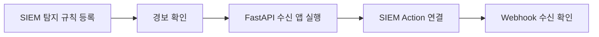

# SIEM으로 이상 행동을 탐지하고 Webhook으로 경보 전송하기

[Filebeat 실습](6.filebeat.md)에서 로그를 수집하고 Kibana 차트로 응답 코드와 로그인 실패 횟수를 확인했습니다. 이제 같은 IP와 계정의 로그인 실패가 일정 횟수를 넘으면 SIEM이 경보를 만들도록 설정합니다. 경보가 생성되는 것을 먼저 확인한 뒤 Webhook으로 전달합니다.

이번 실습은 다음 순서로 진행합니다. Filebeat가 로그를 수집하는 상태에서 시작하고, FastAPI 수신 앱을 실행한 뒤 Connector와 Action을 연결합니다.



앞에서 IP별 로그인 실패 횟수를 차트로 봤다면, 이번에는 “같은 IP와 계정에서 최근 6분 동안 10회 이상 실패”라는 기준을 규칙으로 저장합니다.

이 자료의 `cd`, `ls`, `pwd`, `uv` 명령은 **Windows PowerShell / macOS 터미널 공통**입니다. 강의 프로젝트 폴더에서 실행하며, 경로는 `/`로 표기합니다. 운영체제별 절대 경로 예시는 [Filebeat 자료의 경로·명령 안내](6.filebeat.md)를 참고합니다.

실행 위치와 스크립트 파일을 먼저 확인합니다. 아래 목록에 `generate_sample_logs.py`와 `siem_webhook.py`가 보이면 됩니다.

```shell
pwd
ls ./06_1009_observability
```

## 1. 반복 로그인 실패 탐지 규칙 생성

Kibana에서 **Detection rules (SIEM) → Create new rule**을 열고 규칙 유형을 **Threshold**로 선택합니다. 이미 같은 규칙을 만들었다면 편집 화면에서 설정을 확인합니다.

| 항목 | 설정 |
|---|---|
| Source / Index patterns | `filebeat-*` |
| Group by | `source.ip`, `user.name` |
| Threshold | `10` |
| Name | `반복 로그인 실패 탐지` |
| Severity | `High` |
| Risk score | `73` |
| Runs every | `1 minute` |
| Additional look-back time | `5 minutes` |

Custom query에는 다음 KQL을 입력합니다.

```text
event.dataset: "spring.application" and event.category: "authentication" and event.outcome: "failure"
```

같은 IP와 계정의 로그인 실패가 최근 6분 동안 10건 이상이면 경보를 생성합니다. 기본 샘플에서는 `198.51.100.23 / admin`의 로그인 실패 59건이 이 조건을 충족합니다. 두 로그가 같은 요청을 기록하므로 Spring 로그만 집계합니다.

`Continue`로 기본 정보와 스케줄 설정을 마친 뒤 **Rule actions**에서는 액션을 추가하지 않고 규칙을 저장·활성화합니다. 먼저 Security Alerts에서 탐지 결과를 확인하고, Webhook 전송은 이후 단계에서 연결합니다.

## 2. Security Alerts에서 경보 확인

Filebeat가 실행 중인지 확인하고 강의 프로젝트 폴더의 새 터미널에서 최근 공격 로그를 추가합니다.

```bash
uv run --no-project ./06_1009_observability/generate_sample_logs.py --scenario siem --minutes 1 --append --output-dir ./06_1009_observability/logs
```

Kibana의 **Security Alerts**에서 시간 범위를 `Last 15 minutes`로 설정하고 규칙 이름 `반복 로그인 실패 탐지`로 필터링합니다. 규칙의 다음 실행 후 경보가 표시되는지 확인합니다.

경보 상세에서 규칙 이름과 `source.ip`, `user.name`, `kibana.alert.threshold_result.count`를 확인합니다. Threshold 경보는 집계 결과로 만든 경보이므로 Group by로 사용한 IP와 계정, 임계치를 넘은 횟수를 중심으로 봅니다.

경보가 보이면 로그 수집 → 규칙 실행 → 이상 행동 탐지까지 확인한 것입니다. 경보가 없으면 규칙의 실행 상태, `filebeat-*`의 최근 데이터, 로그인 실패 필드를 먼저 확인합니다. Filebeat 수집 지연과 1분 실행 주기에 따라 시간이 걸릴 수 있습니다.

이 단계는 Security Alerts 화면까지 확인합니다. 다음 단계에서 생성된 경보를 외부 프로그램에 전달합니다.

## 3. Webhook 수신 API 실행

Kibana와 수신 API를 같은 컴퓨터에서 실행합니다. `siem_webhook.py`는 같은 폴더에 있습니다. Windows PowerShell과 macOS 터미널 모두 강의 프로젝트 폴더에서 다음 명령을 실행합니다.

```bash
uv run --script ./06_1009_observability/siem_webhook.py
```

스크립트 상단에 필요한 패키지가 선언되어 있어서 `uv`가 별도 환경에 FastAPI와 Uvicorn을 설치합니다. 최초 실행에는 인터넷 연결이 필요합니다. 프로젝트의 `pyproject.toml`이나 별도의 `uv add` 명령은 필요하지 않습니다.

다음과 같이 표시되면 수신기가 준비된 것입니다. 수신기를 실행한 터미널은 유지합니다.

```text
Uvicorn running on http://127.0.0.1:8081
```

브라우저에서 `http://127.0.0.1:8081/health`를 열면 다음 응답을 확인할 수 있습니다.

```json
{"status": "ok"}
```

이 주소는 같은 컴퓨터에서 실행하는 실습용입니다. Kibana를 Docker나 다른 서버에서 실행하면 그 환경에서 수신 API에 접근 가능한 주소와 바인딩을 별도로 설정해야 합니다.

## 4. Actions 사용 조건 확인

SIEM 규칙을 수정하고 실행할 수 있는 계정으로 Kibana에 로그인합니다. Actions 등록에는 적절한 라이선스와 `Actions and Connectors` 기능의 `All` 권한이 필요합니다.

Webhook 유형이 비활성화되어 있으면 화면의 라이선스 안내를 확인합니다. 라이선스 확인 메뉴는 **Stack Management → License Management**입니다. Trial 활성화는 실습 환경의 관리 정책에 맞춰 별도로 결정합니다.

온프레미스 Kibana는 `kibana.yml`의 `xpack.encryptedSavedObjects.encryptionKey` 설정이 필요합니다. 이 키가 이미 설정되어 있다면 값을 유지합니다. 현재 확인한 실습 설정에는 키가 있습니다.

- [Elastic Security 8.19 Rule actions](https://www.elastic.co/guide/en/security/8.19/rules-ui-create.html#rule-actions)
- [Kibana 8.19 Alerting and action settings](https://www.elastic.co/guide/en/kibana/8.19/alert-action-settings-kb.html)

## 5. Webhook Connector 등록

Kibana에서 **Stack Management → Connectors → Create connector → Webhook**을 선택합니다. **Webhook - Case Management**와 구분해서 일반 **Webhook**을 선택합니다.

| 항목 | 입력값 |
|---|---|
| Connector name | `siem-local-webhook` |
| Method | `POST` |
| URL | `http://127.0.0.1:8081/webhook/siem` |
| Authentication | `None` |
| HTTP header name | `Content-Type` |
| HTTP header value | `application/json` |

저장하면 커넥터가 등록됩니다. 인증 없음 설정은 같은 컴퓨터의 루프백 주소에 한정한 실습용입니다.

커넥터는 전송 주소와 인증 설정을 저장합니다. 실제로 어떤 경보 내용을 전송할지는 다음 단계의 규칙 Actions에서 지정합니다.

## 6. Connector 연결 테스트

커넥터의 **Test** 탭에서 Body에 다음 JSON을 입력하고 **Run**을 실행합니다.

```json
{
  "alert_id": "connector-test-001",
  "rule_id": "manual-test",
  "rule_name": "Webhook 연결 테스트",
  "severity": "low",
  "action_time": "manual-test"
}
```

수신기 터미널에 `SIEM webhook received`와 JSON이 출력되고 커넥터 테스트가 성공하면 연결이 확인된 것입니다. 이 테스트는 SIEM 탐지 규칙을 실행하지 않고 HTTP 연결만 확인합니다.

## 7. 기존 SIEM 규칙의 Actions에 연결

**Detection rules (SIEM)**에서 `반복 로그인 실패 탐지` 규칙을 열고 **Edit → Actions**로 이동합니다.

1. **Add action**에서 **Webhook**을 선택합니다.
2. 커넥터로 **siem-local-webhook**을 선택합니다.
3. Action frequency를 **For each alert**로 설정합니다.
4. 추가 KQL 및 전송 시간 조건은 첫 실습에서는 설정하지 않습니다.
5. Body에 다음 JSON을 입력합니다.

```json
{
  "alert_id": "{{alert.id}}",
  "rule_id": "{{context.rule.id}}",
  "rule_name": "{{context.rule.name}}",
  "severity": "{{context.rule.severity}}",
  "action_time": "{{date}}"
}
```

`{{...}}`는 Kibana가 전송 시 실제 값으로 바꾸는 Mustache 변수입니다. `alert.id`는 **For each alert** 빈도에서 제공되므로 이 Body를 사용할 때 해당 빈도를 유지합니다. `date`는 액션이 예약된 시각이며 원본 로그의 발생 시각과 구분합니다.

규칙 변경을 저장하고 규칙을 활성화합니다. 커넥터 등록만으로는 규칙에 액션이 연결되지 않습니다.

## 8. 새 경보의 Webhook 수신 확인

Actions를 연결한 뒤 최신 로그를 다시 추가하여 새 경보가 전송되는지 확인합니다.

Filebeat와 수신기가 실행 중인지 확인한 뒤 강의 프로젝트 폴더의 새 터미널에서 최근 공격 로그를 추가합니다.

```bash
uv run --no-project ./06_1009_observability/generate_sample_logs.py --scenario siem --minutes 1 --append --output-dir ./06_1009_observability/logs
```

규칙의 다음 실행 후 다음 두 가지를 확인합니다.

- **Security Alerts**: 반복 로그인 실패 경보가 생성됨
- **수신기 터미널**: 실제 경보 ID와 규칙 이름이 포함된 JSON이 출력됨

규칙은 위에서 설정한 1분 간격으로 실행합니다. Filebeat 수집 지연과 규칙 실행 주기에 따라 수신까지 시간이 걸릴 수 있습니다.

## 9. 실패 지점 구분

| 증상 | 확인할 항목 |
|---|---|
| Connector 테스트 실패 | 수신기 실행 여부, URL, 포트, Kibana가 실행되는 컴퓨터 |
| Connector 테스트 성공, SIEM 경보 없음 | Filebeat 수집, 규칙 조건, 최근 조회 시간 범위 |
| SIEM 경보 있음, Webhook 수신 없음 | 규칙 Actions 저장 여부, 커넥터 선택, 전송 조건, 규칙 실행 로그 |
| `alert_id`가 비어 있음 | Action frequency가 `For each alert`인지 확인 |

등록과 JSON 수신까지 확인하면 이번 실습이 완료됩니다. 이후 수신기에 로그 저장이나 RAG 분석을 연결할 수 있습니다.

- [Webhook connector and action 8.19](https://www.elastic.co/guide/en/kibana/8.19/webhook-action-type.html)
- [SIEM 액션 변수 및 설정 8.19](https://www.elastic.co/guide/en/security/8.19/rules-ui-create.html)
